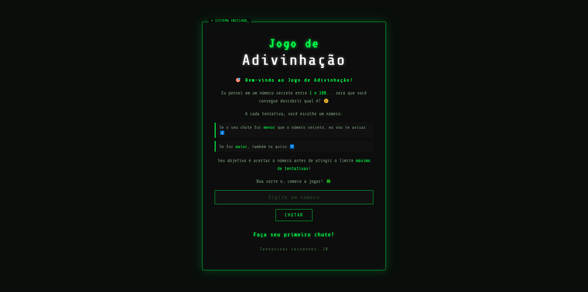

🎯 Jogo de Adivinhação

📌 Sobre o projeto

Este é um jogo simples de adivinhação onde o jogador precisa descobrir um número secreto gerado aleatoriamente entre 1 e 100.

A cada tentativa, o sistema informa se o número digitado é maior ou menor que o número secreto, ajudando o jogador a chegar na resposta correta.

🚀 Tecnologias utilizadas

HTML

CSS

JavaScript

🎮 Como jogar

Abra o arquivo index.html no navegador

Digite um número entre 1 e 100

Clique em "Chutar" (ou equivalente)

Veja a dica:

⬇️ Número menor

⬆️ Número maior

Continue até acertar o número secreto 🎉

📷 Preview

💡 Funcionalidades

Geração de número aleatório

Feedback em tempo real (maior/menor)

Contador de tentativas (se tiver)

Interface simples e intuitiva

📄 Licença

Este projeto foi desenvolvido para fins de estudo.
